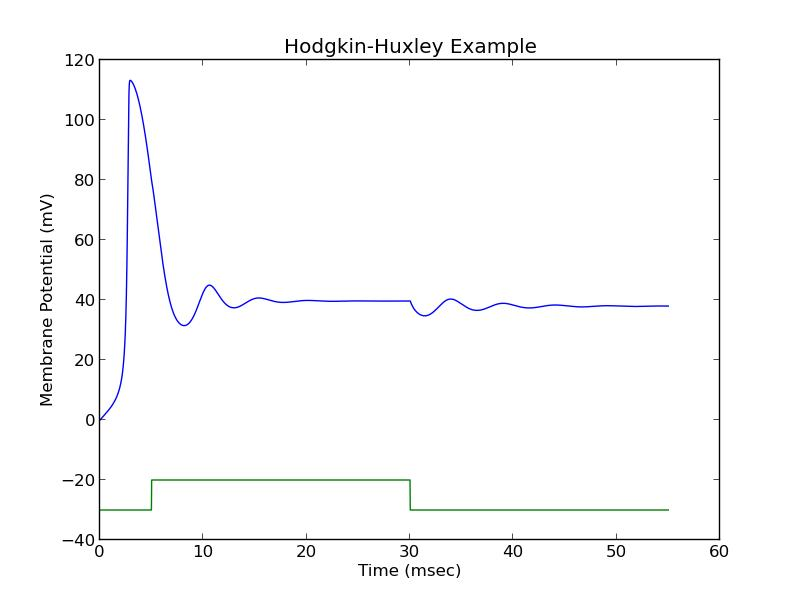
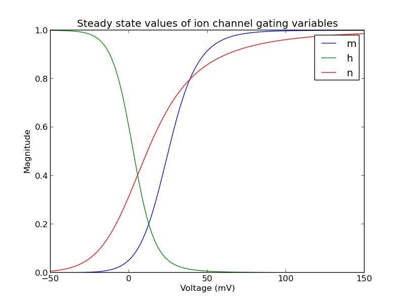

Hodgkin Huxley Model of Neuron Signals
=====================================

Hodgkin and Huxley's original paper (1952): http://www.ncbi.nlm.nih.gov/pmc/articles/PMC1392413/pdf/jphysiol01442-0106.pdf

This was the first evidence of ion channels in cell membranes. Ion channels can control the voltage
across the membrane by passing charged ions (ex. sodium, potassium) through the cell wall. When a signal
travels down a neuron it's by a concerted effort of the ion channels in the membrane, opening and closing in such a way
that the voltage signal travels down the axon of a neuron until it reaches another neuron.

Todo
=====
* ~~Fix the model. It plots but the plot looks kinda weird so one of the equations must be wrong~~

